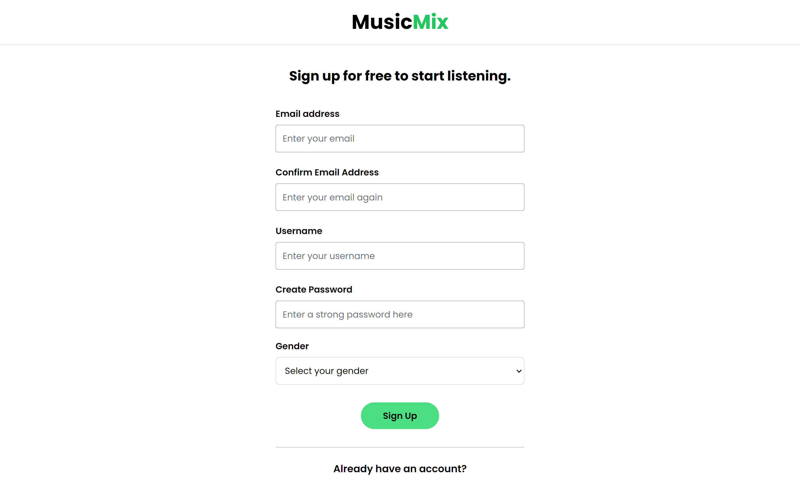

# MusicMix
MusicMix is an impressive Spotify clone, designed to offer a great user experience and Awesome Music Experiences for users

<h4>Live Link: https://musicmix.netlify.app/</h4> 

## About the Project:
A group of four members created this music website in just five days, aiming to practice and test their skills in the MERN stack. 
The motive behind its development was to enhance their proficiency and gain practical experience in web development.

## Tech Stacks and Libraries used

-React

-Tailwind CSS

-Chakra UI

-Styled Components

-Redux

-NodeJS

-ExpressJS

-MongoDB

-Mongoose

## Features ✨

- User authentication, authorizatioon.
- Home Page.
- Listen to songs 
## Contributors  😇

- 👤 [Akhilesh]
- 👤 [Samay]
- 👤 [Shaharyaar]
- 👤 [Suraj]

<h3>Getting Started</h3>
To get started with the project, you can either clone this repository to your local machine:

Or you can fork the repository to your own GitHub account and clone your forked repository.

Once you have the code on your machine, open the project folder in your code editor and start coding.

<h3>Project Structure</h3>

    >frontend
    ├── >src
    │    └── Components
    │    └── images
    │    └── Pages
    │    └── Redux
    │    └── Styling

<h3>Screenshots:</h3>
<h1>Home Page</h1>
 
<h1>SignUp Page</h1>
 

